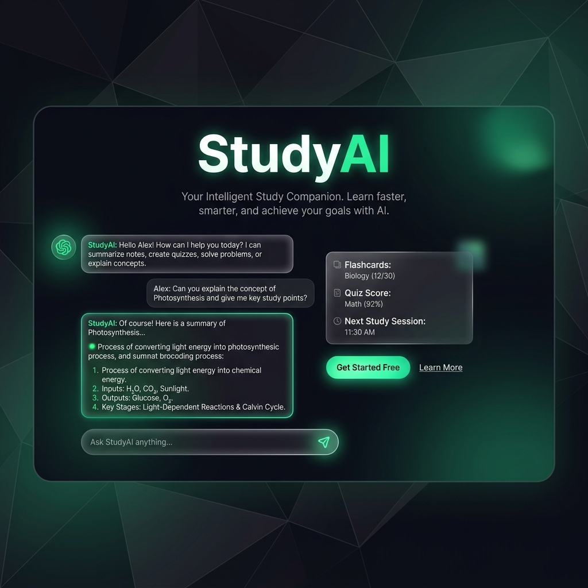
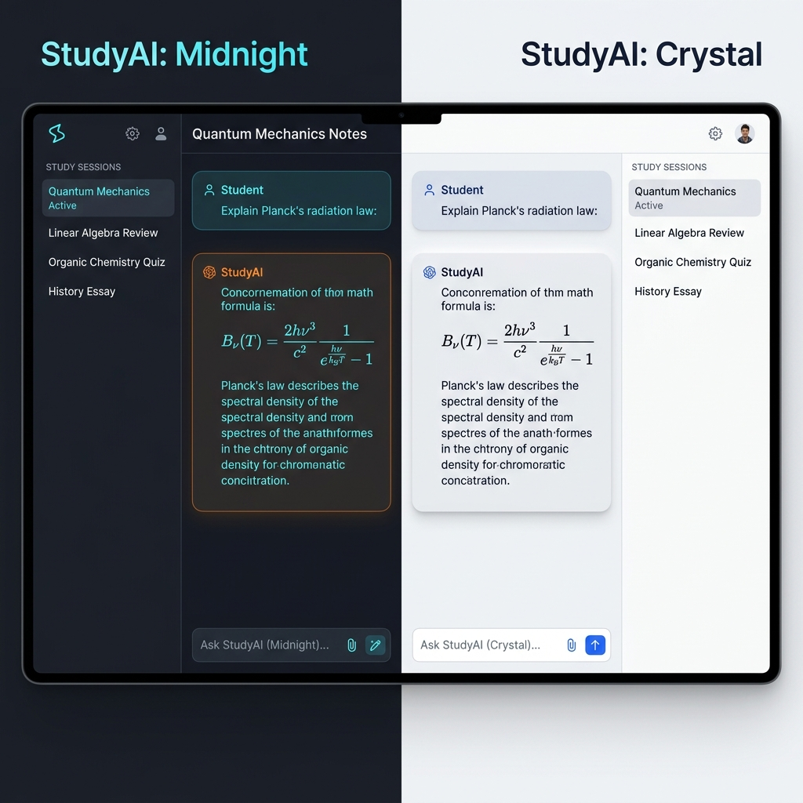

# 📘 StudyAI — Premium AI Student Assistant

[](https://nextjs.org/)
[](https://tailwindcss.com/)
[](https://prisma.io/)
[](https://www.typescriptlang.org/)
[](https://opensource.org/licenses/MIT)

**StudyAI** is a premium, high-performance AI assistant platform designed specifically for students. Built with a sleek, ChatGPT-inspired interface, it provides a sophisticated environment for learning, coding, and academic research.



---

## ✨ Key Features

-   **🧠 Multi-Model Intelligence** — Powered by Google Gemini and OpenAI for state-of-the-art responses.
-   **💬 Persistent Chat History** — Seamlessly manage multiple study sessions with full CRUD capabilities (Rename, Delete, Create).
-   **⚡ Real-Time Streaming** — Experience blazing-fast, word-by-word response streaming for a natural chat feel.
-   **🌗 Dynamic Dark/Light Mode** — A beautiful, premium UI that adapts to your environment with smooth transitions.
-   **📝 Rich Markdown Support** — Support for complex math formulas, code syntax highlighting (`highlight.js`), and structured layouts.
-   **🔒 Secure User Auth** — Native session handling via `NextAuth` and `Prisma` for personalized data storage.
-   **📱 Fully Responsive** — Optimized for desktop, tablet, and mobile with a collapsible side-navigation system.
-   **🛠️ Message Control** — Edit previous questions or regenerate assistant answers to refine your learning path.

---

## 🚀 Tech Stack

StudyAI utilizes a cutting-edge modern stack for maximum speed and scalability:

-   **Frontend**: [Next.js 16](https://nextjs.org/) (App Router), [Tailwind CSS 4.0](https://tailwindcss.com/), [Lucide React](https://lucide.dev/)
-   **Logic**: [TypeScript](https://www.typescriptlang.org/), [React Server Actions](https://react.dev/reference/react/use-server)
-   **Database**: [Prisma ORM](https://www.prisma.io/), [SQLite](https://www.sqlite.org/)
-   **Authentication**: [NextAuth.js](https://next-auth.js.org/)
-   **AI Engines**: [Google Generative AI](https://ai.google.dev/), [OpenAI SDK](https://platform.openai.com/)
-   **Markdown**: [Markdown-it](https://github.com/markdown-it/markdown-it), [Highlight.js](https://highlightjs.org/)

---

## 🛠️ Getting Started

### 1. Prerequisites
Ensure you have **Node.js 20+** and **npm** installed.

### 2. Installation
```bash
git clone https://github.com/fe-rid/study_AI.git
cd study_AI
npm install
```

### 3. Environment Variables
Create a `.env.local` file in the root directory and add your API keys:
```env
GOOGLE_AI_KEY=your_google_ai_api_key
OPENAI_API_KEY=your_openai_api_key
NEXTAUTH_SECRET=your_random_secret_string
NEXTAUTH_URL=http://localhost:3000
DATABASE_URL="file:./studyai.db"
```

### 4. Database Setup
```bash
npx prisma generate
npx prisma db push
```

### 5. Start Development
```bash
npm run dev
```
Open [http://localhost:3000](http://localhost:3000) with your browser to see the result.

---

## 📂 Project Structure

```bash
├── app/               # Next.js App Router (Pages, API Routes, Actions)
├── components/        # Reusable UI Components
├── lib/               # Shared utilities and API logic
├── prisma/            # Database schema and migrations
├── public/            # Static assets and images
├── styles/            # Global styling and Tailwind configuration
└── .env.local         # Environment variables (private)
```

---

## 🖼️ User Interface & Experience

Designing for the best student experience, StudyAI provides a distraction-free, academic-focused environment:
- **Sidebar**: Easy navigation through history with CRUD support.
- **Glassmorphic UI**: High-fidelity dark and light themes for long study nights.
- **Micro-animations**: Smooth transitions during chat and navigation.



---

## 🗺️ Project Roadmap

- [x] **v1.0**: Initial Chat and History implementation.
- [x] **v1.1**: Real-time response streaming and Theme toggle.
- [ ] **v1.2**: Document upload and localized AI analysis (PDF context).
- [ ] **v1.3**: Community 'Study Hub' for collaborative learning.
- [ ] **v1.4**: Chrome Extension for research integration.

---

## 📄 License
This project is licensed under the [MIT License](LICENSE).

---

## 🤝 Contact & Support
Developed with ❤️ by **Alferid**.

-   **GitHub**: [@fe-rid](https://github.com/fe-rid)
-   **Website**: [Portfolio](https://fe-rid.github.io/portfolio/)

---
<p align="center">
  <i>"Empowering students through the lens of artificial intelligence."</i>
</p>

